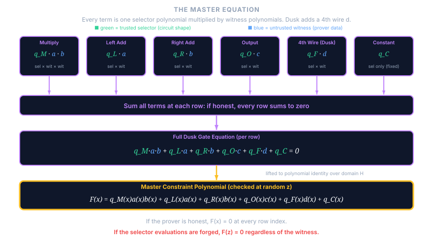
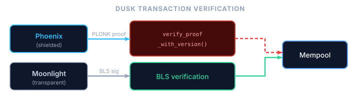
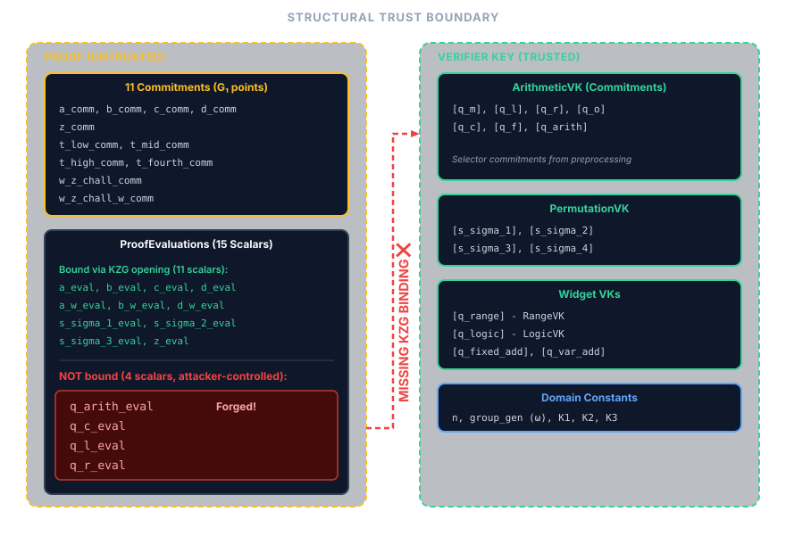
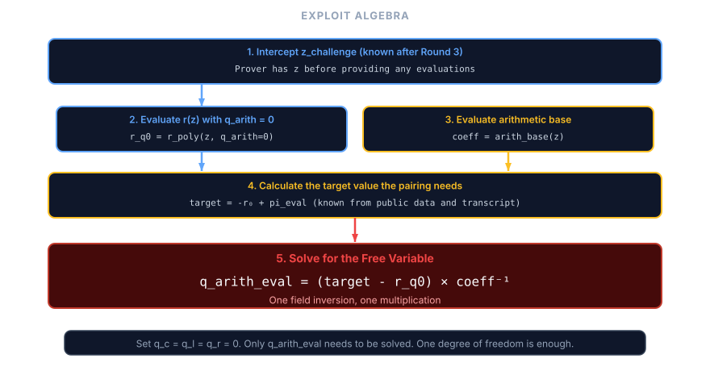
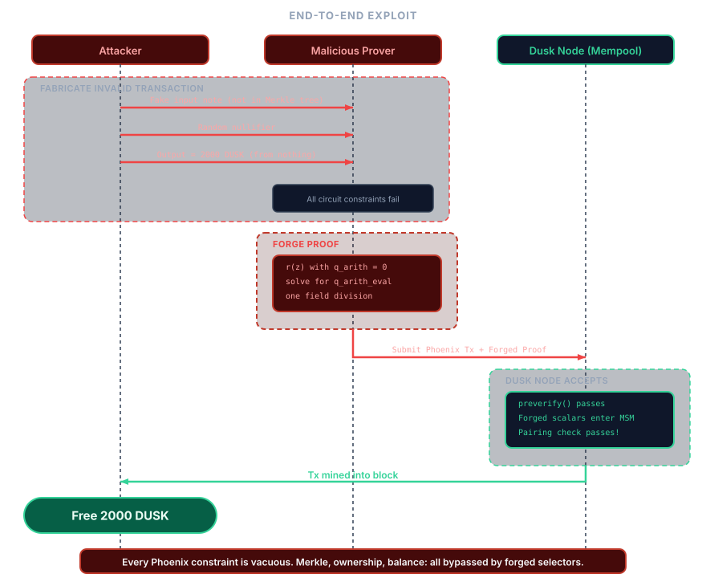

> Mirror of the osec.io post
> [Commitment Issues: Unverified Evaluations in Dusk's PLONK](https://osec.io/blog/unverified-evaluations-dusk-plonk/)
> (canonical), preserved here with its interactive widgets.

We found a critical soundness vulnerability in [dusk-plonk](https://github.com/dusk-network/plonk/), the PLONK implementation powering [Dusk's](https://dusk.network/) ~$60M [market cap](https://www.coingecko.com/en/coins/dusk). By exploiting a gap in the verification step, a malicious prover could forge verifying proofs for arbitrary false statements, bypassing every constraint in the transaction circuit. On the live [Rusk](https://github.com/dusk-network/rusk) network, this would have enabled minting arbitrary amounts of DUSK and moving forged shielded funds through the normal Phoenix path.

The root cause was that the prover slipped four public selector evaluations into the proof struct, and the verifier consumed them in its final equation **without ever validating them against the trusted commitments in the verifier key.** The prover can set them to whatever values make the equation pass.

## How PLONK works (briefly)

For a rigorous treatment see the [original paper](https://eprint.iacr.org/2019/953); what follows covers only the parts needed to understand the bug.

A prover wants to convince a verifier that it knows secret inputs satisfying some computation (an arithmetic circuit) without revealing those inputs, and the resulting proof should be short and quick to verify.

### Arithmetic circuits and constraints

An arithmetic circuit is a series of addition and multiplication gates wired together. An example would be proving that we know of some point $$(x, y)$$ on an elliptic curve, by e.g proving that $$y^2 = x^3 + 7$$, here in $$\mathbb{F}_{37}$$.

<!--  -->

<!--  -->

<arithmetic-circuit-widget>
  
This interactive arithmetic-circuit widget needs JavaScript.
  It lets you move the witness (x, y) over the field F37 and watch the gate table and interpolated polynomials update.
  See the <a href="https://osec.io/blog/unverified-evaluations-dusk-plonk/">original post</a> for the live version.

</arithmetic-circuit-widget>

Each gate $$i$$ has a left input $$l_i$$, right input $$r_i$$, and output $$o_i$$. The prover's job is to show it knows wire values that satisfy every gate.

Each gate imposes a constraint, and PLONK unifies all gate types into one expression using *selector* values that act as switches: setting $$q_M = 1$$ makes a row a multiplication gate, setting $$q_L = 1$$ makes it contribute an addition term, and so on. The selector values define the circuit's shape and are public, known to both prover and verifier, while the wire values are the prover's secret witness. This per-row check does not ensure that wires between gates are consistent (that the output of one gate equals the input of the next); PLONK uses a separate *permutation argument* for that, which we will not cover here.

<!--  -->
<!--  -->

### From many checks to one

Instead of checking each gate individually, PLONK reads the execution trace column by column and uses FFT interpolation to convert each array of values to a single polynomial. The wire values become *witness polynomials* $$f_L(x)$$, $$f_R(x)$$, $$f_O(x)$$ and the selectors become *selector polynomials* $$Q_M(x)$$, $$Q_L(x)$$, etc., all interpolated over a domain $$H$$ of $$n$$-th roots of unity. Evaluating $$f_L(x)$$ at the $$i$$-th root recovers the left wire value at row $$i$$.

<!--  -->
<!--  -->
<!--  -->

<poly-interpolation-panel>
  
This interactive polynomial-interpolation widget needs JavaScript.
  It plots the witness and constraint polynomials as you move the circuit inputs.
  See the <a href="https://osec.io/blog/unverified-evaluations-dusk-plonk/">original post</a> for the live version.

</poly-interpolation-panel>

Because all columns are now polynomials, the entire circuit compresses into a single master constraint polynomial $$F(x)$$ that combines selectors and witnesses. If the prover was honest, $$F(x) = 0$$ at every row index in the domain. The vanishing polynomial $$Z(x) = x^n - 1$$ is zero on exactly those points, so if all constraints hold then $$Z(x)$$ divides $$F(x)$$, yielding a quotient polynomial $$T(x)$$ with $$F(x) = T(x) \cdot Z(x)$$.

<!--  -->
<!--  -->

### Polynomial commitments and opening proofs

To keep the proof short, the prover doesn't send polynomials directly. Instead, it sends *commitments*, short cryptographic fingerprints of each polynomial (using e.g. KZG commitments). When the verifier needs the value of a committed polynomial at a specific point, the prover provides the value along with an *opening proof* that the claimed value is consistent with the earlier commitment.

A committed polynomial evaluation is therefore cryptographically bound, and the prover cannot lie about the value without being caught.

### Reducing to a single random point

After the prover commits to all polynomials, including $$T(x)$$, the verifier picks a random challenge point $$z$$ (derived via the Fiat-Shamir heuristic from the transcript) and checks $$F(z) = T(z) \cdot Z(z)$$ at that single point. By the Schwartz-Zippel lemma, if this holds at a random $$z$$ then the full polynomial identity holds with overwhelming probability, so the verifier checks the entire multi-million-row circuit in constant time.

In textbook PLONK the selector polynomials are part of the fixed circuit description, but in practice implementations commit to them during preprocessing and place those commitments in the verifier key. When the verifier later needs their values at $$z$$, the prover supplies *evaluation claims* that must be checked against those commitments with opening proofs.

The security argument depends on a chain: commitments lock the prover into polynomials *before* challenges are derived, and opening proofs ensure the evaluations are consistent with those commitments, so that breaking any single link in this chain collapses soundness entirely.

---

## Where dusk-plonk differs from textbook PLONK

[`dusk-plonk`](https://github.com/dusk-network/plonk/) is not a literal transcription of the 2019 PLONK paper. It extends the arithmetic gate with a fourth wire `d`, adds custom widgets for range, logic, and elliptic-curve operations, uses shifted evaluations at $$z\omega$$, and heavily batches KZG openings. None of that is exotic by modern PLONK standards, but it does make the verifier harder to reason about than the minimal paper presentation.

The important part for this bug is the boundary between **public circuit data** and **prover claims about that data at the random challenge point**. Parallel implementations avoid this ambiguity by keeping selector polynomials strictly out of the prover's hands. For example, Consensys' gnark (one of the most widely deployed PLONK implementations) never asks the prover for selector evaluations at all. Instead, the verifier incorporates the selector commitments `Ql, Qr, Qm, Qo, Qk` directly into the [linearization multi-scalar multiplication](https://github.com/Consensys/gnark/blob/17b079f1b813d9dafd465202466b09f282b4c5e9/backend/plonk/bls12-381/verify.go#L253-L270), ensuring their values are cryptographically bound by construction.

Dusk's custom widgets were more complex (multiplying selectors with other evaluated terms), so they could not just use a simple linear combination of commitments. Their architecture required evaluating the selectors at $$z$$ and using those scalars. But while they serialized those four selector evaluations into the proof struct, they never actually verified them against the verifier key's commitments through an opening proof.

The shortest way to see the bug is the graph below: safe values flow through the opening path toward the final pairing check, while the red selector flow enters verifier logic without ever touching an opening proof.

<dusk-verifier-graph>
  
This verifier dependence-graph widget needs JavaScript.
  It traces which proof values reach the final pairing check and highlights the four selector evaluations
  that were consumed without an opening proof. See the
  <a href="https://osec.io/blog/unverified-evaluations-dusk-plonk/">original post</a> for the live version.

</dusk-verifier-graph>

---

## How Dusk uses PLONK

[Dusk](https://dusk.network/) is a privacy-focused L1 blockchain. Its transaction model has two modes:

- Phoenix (shielded): amounts and participants are hidden using ZK proofs, and every Phoenix transaction carries a PLONK proof that the transaction is valid.
- Moonlight (transparent): standard account-based transactions verified by BLS signatures, with no PLONK involvement.

At node level, every [`ProtocolTransaction::Phoenix`](https://github.com/dusk-network/rusk/blob/264c1ec0f4c005ef043b87deb1c866035e034330/rusk/src/lib/node/vm.rs#L152-L185) goes through [`verify_proof_with_version()`](https://github.com/dusk-network/rusk/blob/264c1ec0f4c005ef043b87deb1c866035e034330/rusk/src/lib/verifier.rs#L71-L82) during preverification. If that PLONK proof verifies, the transaction is admitted to the mempool and can later be mined into a block. Moonlight-path transactions instead go through BLS signature verification.

That same Phoenix proof path covers more than simple shielded transfers. Phoenix-path staking, reward withdrawals, unstaking, and Phoenix-to-Moonlight conversion all build a Phoenix transaction via [`phoenix()`](https://github.com/dusk-network/rusk/blob/264c1ec0f4c005ef043b87deb1c866035e034330/wallet-core/src/transaction.rs#L54-L95), for example in [`phoenix_stake()`](https://github.com/dusk-network/rusk/blob/264c1ec0f4c005ef043b87deb1c866035e034330/wallet-core/src/transaction.rs#L144-L186), [`phoenix_stake_reward()`](https://github.com/dusk-network/rusk/blob/264c1ec0f4c005ef043b87deb1c866035e034330/wallet-core/src/transaction.rs#L240-L298), [`phoenix_unstake()`](https://github.com/dusk-network/rusk/blob/264c1ec0f4c005ef043b87deb1c866035e034330/wallet-core/src/transaction.rs#L358-L416), and [`phoenix_to_moonlight()`](https://github.com/dusk-network/rusk/blob/264c1ec0f4c005ef043b87deb1c866035e034330/wallet-core/src/transaction.rs#L481-L539). So if Phoenix proof verification is unsound, the entire shielded transaction path is exposed.

<!--  -->

The PLONK implementation, [dusk-plonk](https://github.com/dusk-network/plonk), is a standalone library by the Dusk team. It was among the first PLONK implementations written, with development starting the same year [the original paper](https://eprint.iacr.org/archive/2019/953/1566424053.pdf) was released.

The Phoenix transaction PLONK circuit is defined [here](https://github.com/dusk-network/phoenix/blob/1bb89b289b3d32115c49fdf80f7f4164578a283a/circuits/src/circuit_impl.rs#L20-L205). The circuit enforces the following set of constraints:

| Circuit check | Statement being checked
|---|---|
| [Merkle tree membership](https://github.com/dusk-network/phoenix/blob/1bb89b289b3d32115c49fdf80f7f4164578a283a/circuits/src/circuit_impl.rs#L106-L126) | Each input note hash is opened against the public Merkle root, so only notes already in the note tree may be spent |
| [Input-note secret-key authorization](https://github.com/dusk-network/phoenix/blob/1bb89b289b3d32115c49fdf80f7f4164578a283a/circuits/src/circuit_impl.rs#L70-L79) | The prover knows the secret key controlling each input note |
| [Nullifier correctness](https://github.com/dusk-network/phoenix/blob/1bb89b289b3d32115c49fdf80f7f4164578a283a/circuits/src/circuit_impl.rs#L81-L87) | Each nullifier matches the corresponding note key and position |
| [Output value commitment correctness](https://github.com/dusk-network/phoenix/blob/1bb89b289b3d32115c49fdf80f7f4164578a283a/circuits/src/circuit_impl.rs#L149-L160) | Each public output commitment matches the secret output value and blinder |
| [Balance integrity](https://github.com/dusk-network/phoenix/blob/1bb89b289b3d32115c49fdf80f7f4164578a283a/circuits/src/circuit_impl.rs#L167-L178) | $$\sum \text{inputs} = \sum \text{outputs} + \text{fee} + \text{deposit}$$ |
| [Range checks on inputs](https://github.com/dusk-network/phoenix/blob/1bb89b289b3d32115c49fdf80f7f4164578a283a/circuits/src/circuit_impl.rs#L89-L90) and [outputs](https://github.com/dusk-network/phoenix/blob/1bb89b289b3d32115c49fdf80f7f4164578a283a/circuits/src/circuit_impl.rs#L141-L142) | All note values lie in $$[0, 2^{64}-1]$$ |
| [Sender-authorship signatures](https://github.com/dusk-network/phoenix/blob/1bb89b289b3d32115c49fdf80f7f4164578a283a/circuits/src/sender_enc.rs#L28-L51) | The transaction payload is signed by the sender's two signing key components |
| [Sender encryption correctness](https://github.com/dusk-network/phoenix/blob/1bb89b289b3d32115c49fdf80f7f4164578a283a/circuits/src/sender_enc.rs#L63-L121) | The sender data attached to each output note is a correct ElGamal encryption under the recipient note key |

Rusk does not consume these claims one by one. It consumes a single valid/invalid proof verdict over `tx.public_inputs()` via [`verify_proof_with_version()`](https://github.com/dusk-network/rusk/blob/264c1ec0f4c005ef043b87deb1c866035e034330/rusk/src/lib/verifier.rs#L71-L82).

A soundness break in PLONK voids all of these constraints simultaneously, because forged selector evaluations make the entire circuit unconstrained rather than targeting any single check.

---

## The bug

In the [PLONK verification](https://github.com/dusk-network/plonk/blob/82c08e8f11f2db774e4e8d28e6ba7ef833cbff25/src/proof_system/proof.rs#L362-L400), the verifier batches polynomial evaluations into a single KZG opening proof check. The ten evaluations stored in [`E_evals`](https://github.com/dusk-network/plonk/blob/82c08e8f11f2db774e4e8d28e6ba7ef833cbff25/src/proof_system/proof.rs#L362-L373) are:

- `a_eval`, `b_eval`, `c_eval`, `d_eval` (witness)
- `s_sigma_1_eval`, `s_sigma_2_eval`, `s_sigma_3_eval` (permutation)
- `a_w_eval`, `b_w_eval`, `d_w_eval` (shifted witness)

In addition, `z_eval` (the permutation accumulator at the shifted point) is added separately into `E_scalar` with coefficient `u`, so it is still part of the opening check even though it is not literally one of the ten `E_evals` entries.

But the following selector evaluations were *not* included:
- `q_arith_eval` (arithmetic selector)
- `q_c_eval` (constant selector)
- `q_l_eval` (left selector)
- `q_r_eval` (right selector)

The four selector evaluations are values the prover places in the proof struct, the verifier absorbs into the transcript, and the widget verifier code uses directly in the linearization check ([proof struct](https://github.com/dusk-network/plonk/blob/82c08e8f11f2db774e4e8d28e6ba7ef833cbff25/src/proof_system/linearization_poly.rs#L33-L83), [transcript absorption](https://github.com/dusk-network/plonk/blob/82c08e8f11f2db774e4e8d28e6ba7ef833cbff25/src/proof_system/proof.rs#L255-L286), [arithmetic widget](https://github.com/dusk-network/plonk/blob/82c08e8f11f2db774e4e8d28e6ba7ef833cbff25/src/proof_system/widget/arithmetic/verifierkey.rs#L92-L118), [fixed-base ECC widget](https://github.com/dusk-network/plonk/blob/82c08e8f11f2db774e4e8d28e6ba7ef833cbff25/src/proof_system/widget/ecc/scalar_mul/fixed_base/verifierkey.rs#L46-L102)). But they are never checked against the corresponding selector commitments in the verifier key, even though those commitments already exist. The prover sends whatever values it wants and the verifier trusts them.

The easiest way to see why these four omissions are special is to contrast them with two nearby cases that are *not* bugs:

- There is no prover-supplied $$c(z\omega)$$ field at all. `ProofEvaluations` contains `a_w_eval`, `b_w_eval`, and `d_w_eval`, but no `c_w_eval`, so the verifier never consumes an unbound $$c(z\omega)$$ claim ([proof struct](https://github.com/dusk-network/plonk/blob/82c08e8f11f2db774e4e8d28e6ba7ef833cbff25/src/proof_system/linearization_poly.rs#L33-L83)).
- There is a fourth permutation commitment $$[\sigma_4]$$ in the verifier key, but the verifier uses the commitment itself inside the linearization MSM rather than trusting a prover-supplied scalar $$\sigma_4(z)$$ ([permutation verifier key](https://github.com/dusk-network/plonk/blob/82c08e8f11f2db774e4e8d28e6ba7ef833cbff25/src/proof_system/widget/permutation/verifierkey.rs#L24-L104)).

The four selector evaluations fit neither of these safe patterns: they are prover-supplied scalars, they are used directly by verifier code, and they never appear in [`E_evals`](https://github.com/dusk-network/plonk/blob/82c08e8f11f2db774e4e8d28e6ba7ef833cbff25/src/proof_system/proof.rs#L361-L373), which leaves the master equation underconstrained.

<!--  -->

---

## The exploitation

Since the selector evaluations are free variables, the verification equation becomes a linear equation the prover can solve after the fact.

The prover commits to arbitrary witness polynomials (it doesn't need to know a valid witness) and arbitrary quotient polynomials (small random linear polynomials suffice). It follows the honest protocol through all commitment rounds, deriving the same challenges the verifier will. After seeing `z_challenge`, it computes what the linearization polynomial *should* evaluate to for the pairing check to pass, then solves for `q_arith_eval`, the single free variable that makes the verification equation balance (setting `q_c_eval = q_l_eval = q_r_eval = 0`).

<!--  -->
<!--  -->

To achieve this one may compute the linearization polynomial $$r(x)$$ with all selectors set to zero, evaluating it at $$z$$, and comparing to the target value; the difference divided by the coefficient of `q_arith_eval` gives the required value in a single field division.

---

## Impact on Dusk

PLONK is the sole gatekeeper for Phoenix-specific correctness claims: note membership, ownership, note commitments, sender-authorship, and balance integrity are encoded entirely in the circuit. Rusk does check other preconditions such as nullifier uniqueness before it verifies the proof ([preverify path](https://github.com/dusk-network/rusk/blob/264c1ec0f4c005ef043b87deb1c866035e034330/rusk/src/lib/node/vm.rs#L153-L184)), but for the claims inside the proof there is no secondary validation path. With forged proofs, an attacker could:

1. Inflate the token supply by fabricating input notes that do not exist in the note tree, with arbitrary values. The forged proof convinces the network these notes are real, and the attacker mints DUSK out of nothing, ready to transfer to honest users or exchanges.
2. Forge spends that bypass the ownership, membership, and balance checks that normally make a Phoenix input note valid.
3. Move forged shielded funds through honest wallets, because once a forged Phoenix transaction is accepted, the resulting shielded outputs are not distinguishable from legitimate Phoenix outputs at the protocol level.

We demonstrated this with a full end-to-end proof-of-concept on a local Dusk testnet:

1. Set up a single honest Rusk node and create two wallets (honest and malicious), both with balance 0
2. The malicious wallet forges a PLONK proof to create **2000 DUSK from nothing**
3. The malicious wallet transfers **1337 DUSK** to the honest wallet using a normal (honestly-proved) transaction
4. The honest node validates both transactions and mines them into blocks
5. The honest wallet shows a confirmed balance of 1337 DUSK

<!-- -->

<!--  -->

At the time of discovery, DUSK's market cap was roughly [~60M USD](https://www.coingecko.com/en/coins/dusk). The entire shielded transaction layer was at risk. Because Phoenix is privacy-preserving, forged outputs accepted into the shielded pool would have been difficult to distinguish after the fact, much as Neptune Cash later described after the [Triton VM vulnerability](https://neptune.cash/articles/critical-vulnerability-disclosure).

---

## The fix

The fix adds the four selector evaluations to the KZG batch opening check, so they are verified against the selector commitments already present in the verifier key:

- Extend [`compute_aggregate_witness`](https://github.com/dusk-network/plonk/blob/82c08e8f11f2db774e4e8d28e6ba7ef833cbff25/src/compiler/prover.rs#L509) on the prover side to also include `q_arith`, `q_c`, `q_l`, and `q_r`
- Add their evaluations to [`E_evals`](https://github.com/dusk-network/plonk/blob/82c08e8f11f2db774e4e8d28e6ba7ef833cbff25/src/proof_system/proof.rs#L362) on the verifier side, so they're checked against the commitments in the verifier key

This was done in [commit 645265b7](https://github.com/dusk-network/plonk/commit/645265b748d2698bcb403b794fc2d58340b340f1), which landed on February 14, 2026.

---

## Why was this missed?

Dusk's stack had been heavily audited: a [December 2023 audit of dusk-plonk](https://github.com/dusk-network/audits/blob/main/core-audits/2023-12_plonk-audit-report_porter-adams.pdf), a [September 2024 audit of Phoenix](https://github.com/dusk-network/audits/blob/main/core-audits/2024-09_phoenix-audit-report_jules-de-smit.pdf), and a [September 2024 Oak Security audit of the Rusk node library](https://github.com/dusk-network/audits/blob/main/core-audits/2024-09_rusk-node-library_oak-security.pdf). Dusk's public [audits overview](https://dusk.network/news/audits-overview) summarizes the broader audit program. The bug still went unnoticed because it hides behind a very easy mental-model mistake.

At the polynomial level, selectors are public circuit descriptions. A reviewer who keeps that standard PLONK model in mind will naturally think "selectors are verifier-side" and move on, overlooking the architectural deviation where Dusk's verifier started consuming prover-supplied selector *evaluations*.

This was a pure proof-system bug, not a Phoenix-circuit bug; the circuit constraints themselves were correctly written. The failure occurred entirely because the verifier accepted proof fields that bypassed the fundamental invariant established earlier: they were neither locally computed nor cryptographically bound to an opening proof.

The check for this class of bug is mechanical: enumerate every field in the proof's evaluation struct and verify that each one either appears in the opening proof batch or is computed locally by the verifier.

## A similar bug in Espresso Systems' Jellyfish

While investigating PLONK implementations, we found a similar vulnerability in [jf-plonk](https://github.com/EspressoSystems/jellyfish/) by Espresso Systems. The exact mechanism is different, but the exploitation also boils down to variables that are used in the final check not being cryptographically bound.

Jellyfish implements UltraPlonk, which extends standard PLONK with [Plookup](https://eprint.iacr.org/2020/315) lookup arguments. Plookup adds 15 polynomial evaluations to the proof. The function [`append_plookup_evaluations`](https://github.com/EspressoSystems/jellyfish/blob/83e62ed43140d251f8a972033fdd9ddb717c66d7/plonk/src/transcript/mod.rs#L156-L166) was supposed to add all 15 to the Fiat-Shamir transcript before the batching challenge $$v$$ is derived. Instead, it only added 6 of the 15, and the remaining 9 evaluations are used in the batched verification check but don't influence $$v$$, so the prover can adjust them after the fact to make the check pass.

The attack requires modifying a single evaluation (`key_table_next_eval`) by `delta / (u * v^3)` to close the gap between the true and expected batched evaluation, which, like the Dusk exploit, reduces to a single field division.

To our knowledge, Jellyfish's UltraPlonk mode is not currently deployed in production. [PR #867](https://github.com/EspressoSystems/jellyfish/pull/867) fixed the issue and was tagged as [`jf-plonk-v0.8.0`](https://github.com/EspressoSystems/jellyfish/tree/jf-plonk-v0.8.0) on March 18, 2026.

---

## Toward standardization

The fact that two independent PLONK implementations contain the same class of bug, and that [similar patterns appear across zkVMs](https://osec.io/blog/zkvms-unfaithful-claims/), suggests this isn't a problem that individual audits alone can solve. The check described above (diff "evaluations used" against "evaluations bound") is mechanical and could be built into development tooling, CI pipelines, or standardized PLONK verification specifications.

We're in early discussions with the Dusk team and other stakeholders about what a PLONK standardization effort could look like: a curve-agnostic, backend-agnostic specification of the verification protocol that makes invariants like evaluation binding explicit and checkable.

The status quo, where each team implements their own PLONK variant from the paper and hopes the auditor catches what they missed, is fragile. A shared, well-reviewed verification spec would reduce the surface area for these bugs and give auditors a concrete checklist to verify against.

## Disclosure timeline

| Date | Event |
|---|---|
| 2026-02-13 | Dusk vulnerability reported |
| 2026-02-14 | Dusk acknowledged |
| 2026-02-14 | Dusk fix committed |
| 2026-02-27 | Public [`dusk-rusk-1.6.0`](https://github.com/dusk-network/rusk/releases/tag/dusk-rusk-1.6.0) release published |
| 2026-03-16 | Jellyfish fix PR opened ([#867](https://github.com/EspressoSystems/jellyfish/pull/867)) |
| 2026-03-18 | Jellyfish fix merged in [#867](https://github.com/EspressoSystems/jellyfish/pull/867) and tagged as [`jf-plonk-v0.8.0`](https://github.com/EspressoSystems/jellyfish/tree/jf-plonk-v0.8.0) |

## Acknowledgements

We thank the Dusk team for responding within a day, coordinating the fix transparently, and engaging on the broader standardization question. We also thank the Espresso Systems team for turning around the Jellyfish patch in under a week.
