> Mirror of [Unfaithful Claims: Breaking 6 zkVMs](https://osec.io/blog/zkvms-unfaithful-claims/) on osec.io.

A zkVM verifier should be faithful to one thing above all else: its public claims. If the claimed input/output statement is false, verification must fail.

We found six systems where this faithfulness breaks. Across **Jolt**, **Nexus**, **Cairo-M**, **Ceno**, **Expander**, and **Binius64**, public-claim data was not always bound into Fiat-Shamir transcripts before challenge generation. That subtle ordering bug turns statement values into attacker-controlled variables in later verification equations.

In this post, we demonstrate how to exploit these unbound variables to bypass the cryptography entirely and prove mathematically impossible statements, such as finding a counterexample to Fermat's Last Theorem (see [Challenges](#challenges) to try this out yourself). In a blockchain context, this could translate to receiving $1M out of thin air.

---

## Jargon Cheat Sheet

Before we go deeper, here's a one-liner for every term you'll encounter. The ZK ecosystem is particularly full of jargon and abbreviations, which may be off-putting to newcomers. Bookmark this section.

- **Fiat-Shamir**: Instead of a real verifier sending random challenges, hash everything so far to get "random" challenges. Makes proofs non-interactive.
- **Transcript**: The running hash state. You "absorb" data into it, then "squeeze" out challenges.
- **Polynomial Commitment**: Like a hash, but for polynomials. You commit to a polynomial, then later prove "my polynomial evaluates to 42 at point 7" without revealing the whole polynomial.
- **Sumcheck**: A protocol to prove "this polynomial sums to H over all boolean inputs" without actually computing the exponentially many terms. Reduces to checking one random point.
- **MLE (Multilinear Extension)**: Turn a table of values into a polynomial. The polynomial equals the table on 0/1 inputs and smoothly interpolates elsewhere. Key property: evaluating it is a linear function of the table entries.
- **Lookup / LogUp**: Prove "all my values appear in this table" by encoding membership as sums of fractions. If the sums match, the sets match (with high probability).
- **AIR**: "Algebraic Intermediate Representation" - a way to write "valid execution trace" as polynomial equations. If the equations hold, the trace is valid.
- **STARK**: Prove AIR constraints hold using commitments + random sampling + FRI. No trusted setup needed.
- **FRI**: "Fast Reed-Solomon IOP" - proves a committed function is actually a low-degree polynomial, not arbitrary garbage that passes spot-checks.
- **OODS**: "Out-of-Domain Sampling" - check the constraint polynomial at a random point outside the execution domain. Ties everything together.
- **GKR**: Verify arithmetic circuits layer-by-layer using sumcheck. Reduces "check this huge circuit" to "check a few random evaluations."
- **claimed_sum / opening_claim**: Prover-supplied values that feed into verification equations. **These are the usual suspects for binding bugs.**

---

## What Are We Even Breaking?

### What is a zkVM?

A zkVM proof claims that a program executed correctly on public inputs, producing the claimed public output, while hiding the full execution trace.

Formally, the verifier is convinced that there exists a valid trace $$T$$ such that:

$$\exists \; T \; : \; \mathsf{VM}(P, X, T) \to Y$$

where:
- $$P$$ = program/circuit description (public)
- $$X$$ = public input
- $$Y$$ = claimed public output
- $$T$$ = private witness/trace (registers, memory history, intermediate values)

The verifier does **not** replay execution step by step. Instead, it checks algebraic constraints over committed polynomials.

Some systems in this post are verifiable-computing systems rather than full zero-knowledge systems, but the critical property is still **soundness**:
- **Completeness**: honest execution verifies.
- **Soundness**: false execution should not verify.

We are breaking **soundness** in all six systems.

In all six codebases, verification follows this abstract flow:
1. Fix public statement data.
2. Parse proof payload (commitments, reduction messages, openings).
3. Rebuild Fiat-Shamir challenges from transcript state.
4. Check constraint equations at sampled points.
5. Check PCS/opening consistency.
6. Accept only if all checks are jointly consistent.

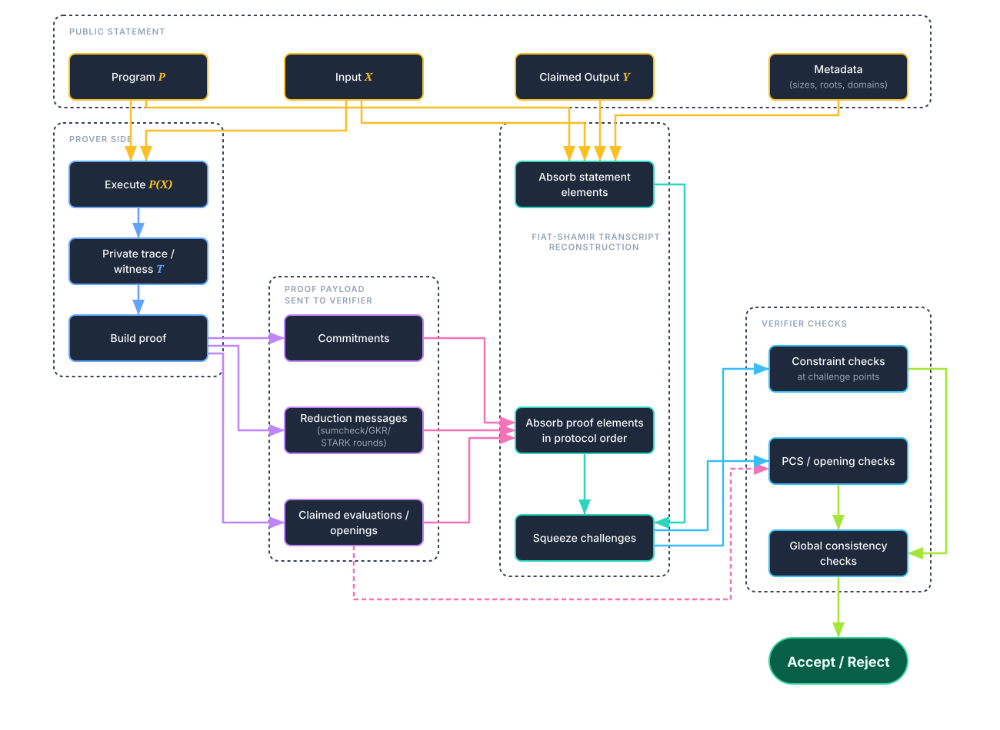

The non-negotiable invariant is transcript ordering: if a value affects a verifier equation, it must be absorbed before sampling the challenge that gates that equation. Violating this gives the prover an attacker-controlled degree of freedom.


---

## The Building Blocks

Before we can understand the bugs, we need to understand the protocols they break. Each of these is a tool that zkVMs compose together.

### The Fiat-Shamir Transform

Interactive protocols (the type most commonly described in literature) require real-time communication. It involves the verifier sending random challenges, and the prover responding to them. This doesn't work for blockchains (where you have no real-time verifier) or when you want anyone to verify your proof at a later point.

The solution is to replace the verifier's randomness with a hash function. The prover "talks to themselves," using the hash of everything so far as the challenge. If we use a cryptographic hash function, this should mean that the challenges are completely unpredictable.


<!--  -->

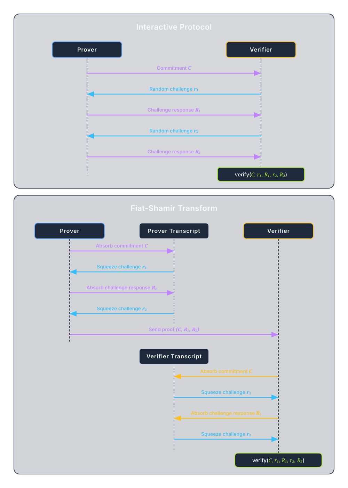

<!--```mermaid
%%{init: {'theme': 'base', 'themeVariables': {'fontFamily': 'ui-sans-serif, Inter, system-ui', 'primaryColor': '#e8f1ff', 'primaryTextColor': '#0f172a', 'primaryBorderColor': '#1e3a8a', 'lineColor': '#334155', 'secondaryColor': '#f8fafc', 'tertiaryColor': '#fff7ed'}}}%%
sequenceDiagram
    participant P as Prover
    participant T as Transcript (Hash State)
    participant V as Verifier

    Note over P,V: Interactive Protocol
    P->>V: commitment C
    V->>P: random challenge r_1
    P->>V: response R_1
    V->>P: random challenge r_2
    P->>V: response R_2
    V->>V: verify(C, r_1, R_1,<br/>r_2, R_2)

    Note over P,V: After Fiat-Shamir Transform
    P->>T: absorb(C)
    T->>P: r_1 = squeeze()
    P->>T: absorb(R_1)
    T->>P: r_2 = squeeze()
    P->>V: proof = (C, R_1, R_2)
    V->>V: recompute r_1, r_2 from transcript
    V->>V: verify(C, r_1, R_1,<br/>r_2, R_2)
```-->

The hash (transcript) **must** include everything that affects verification **BEFORE** the challenges derived from it are used.

If some value $$V$$ affects a verification equation, but $$V$$ isn't absorbed before the relevant challenge is squeezed, then the challenge is completely independent of $$V$$. This means that the prover can "see" (compute in advance) the challenge before choosing $$V$$, which may allow it to choose $$V$$ exactly so that the verification passes, even though it should not.

This is the bug class we found in all six systems.

### The Sumcheck Protocol

The sumcheck protocol proves that a polynomial sums to a claimed value over the Boolean hypercube (all inputs in $$\{0,1\}^n$$), i.e the claim:

$$H = \sum_{x_1 \in \{0,1\}} \sum_{x_2 \in \{0,1\}} \cdots \sum_{x_n \in \{0,1\}} g(x_1, x_2, \ldots, x_n)$$

The naive approach would be for the verifier to compute all $$2^n$$ evaluations. This is exponentially expensive.

The sumcheck protocol is a clever interactive protocol that reduces the exponential number of polynomial evaluations to checking **only one**.

<!--  -->

<!---->

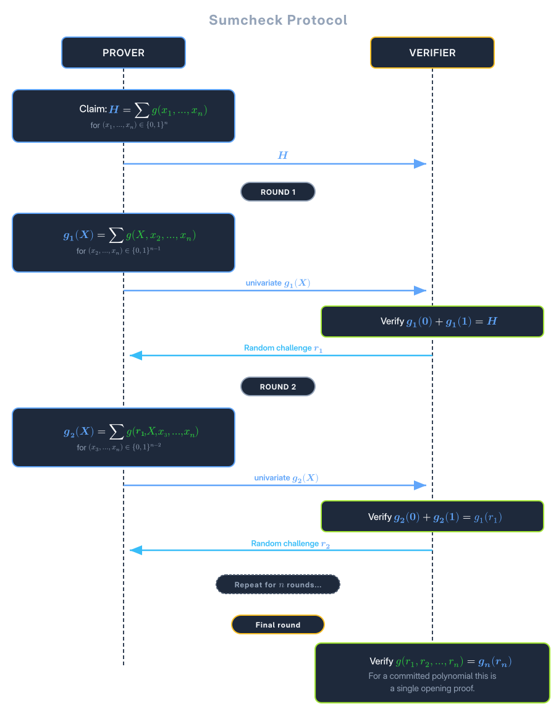


<!--```mermaid
%%{init: {'theme': 'base', 'themeVariables': {'fontFamily': 'ui-sans-serif, Inter, system-ui', 'primaryColor': '#e8f1ff', 'primaryTextColor': '#0f172a', 'primaryBorderColor': '#1e3a8a', 'lineColor': '#334155', 'secondaryColor': '#f8fafc', 'tertiaryColor': '#fff7ed'}}}%%
sequenceDiagram
    participant P as Prover
    participant V as Verifier

    Note over P,V: Claim: H = \sum g(x_1,...,x_n)<br/>over {0,1}^n

    rect rgb(240, 248, 255)
        Note over P,V: Round 1
        P->>V: g_1(X) = \sum_{x_2,...,x_n}<br/>g(X, x_2,...,x_n)
        Note over V: Check: g_1(0) + g_1(1) = H
        V->>P: random challenge r_1
    end

    rect rgb(255, 248, 240)
        Note over P,V: Round 2
        P->>V: g_2(X) = \sum_{x_3,...,x_n}<br/>g(r_1, X, x_3,...,x_n)
        Note over V: Check: g_2(0) + g_2(1) = g_1(r_1)
        V->>P: random challenge r_2
    end

    Note over P,V: ... continue for n rounds ...

    rect rgb(240, 255, 240)
        Note over P,V: Final Round
        Note over V: Check: g(r_1, r_2, ..., r_n)<br/>= g_n(r_n)
        Note over V: (verify with polynomial commitment)
    end
```    -->

In each round, the prover must send a polynomial $$g_i(X)$$ such that $$g_i(0) + g_i(1)$$ equals the previous claim. If the prover is lying about the original sum $$H$$, then they must lie about $$g_i$$ somewhere. But since the verifier picks a random $$r_i$$, with overwhelming probability, the prover won't then be able to match the evaluation of the original polynomial.

#### The Compression Trick 

For degree-1 (multilinear) polynomials, $$g_i(X) = a + bX$$ has only two coefficients. Since the verifier knows $$g_i(0) + g_i(1) = H_{i-1}$$ (the previous claim), we have:

$$a + (a + b) = H_{i-1} \implies b = H_{i-1} - 2a$$

So the prover only sends $$a = g_i(0)$$, and the verifier recovers $$b$$. This saves 50% on communication costs.

The next claim in the chain is

$$H_i = g_i(r_i) = a + b \cdot r_i = a + (H_{i-1} - 2a) \cdot r_i = a(1 - 2r_i) + H_{i-1} \cdot r_i$$

This is **linear in $$H_{i-1}$$**! By induction, the final claim is linear in the original $$H$$. If $$H$$ isn't in the transcript, we can solve for it.

### Multilinear Extensions (MLEs)

An MLE is just the polynomial view of a table over $$\{0,1\}^n$$: it matches the table on Boolean points and extends it to field points.

For this post, the only property you need is:

$$\tilde{f}(\vec{r}) = \sum_{\vec{b} \in \{0,1\}^n} f(\vec{b}) \cdot \text{eq}(\vec{b}, \vec{r})$$

At a fixed challenge point $$\vec{r}$$, the coefficients $$\text{eq}(\vec{b}, \vec{r})$$ are constants, so $$\tilde{f}(\vec{r})$$ is linear in the table values $$f(\vec{b})$$.

That linearity is exactly why missing transcript binding is dangerous: if $$\vec{r}$$ is sampled before those values are bound, an attacker can reprogram values while preserving the same evaluated claim.

### Lookup Arguments (LogUp)

zkVMs need to check that values satisfy certain properties. For example:
- Is this byte in range $$[0, 255]$$?
- Does this opcode decode correctly?
- Is this memory access consistent with previous accesses?

**The naive approach:** Add constraints for each check. Expensive.

**The clever approach:** Precompute a table of valid tuples. Prove that every value the program uses appears in the table. This is a **multiset membership** check.

**LogUp (Logarithmic Derivative):** Encode multiset membership as a sum of fractions.

If set $$A$$ should equal set $$B$$ as multisets:

$$\sum_{a \in A} \frac{1}{z - a} = \sum_{b \in B} \frac{1}{z - b}$$

for random challenge $$z$$. If the multisets match, the sums are equal. If they differ, the sums differ with overwhelming probability.

**In zkVMs:** Different components emit and consume lookup tuples:
- CPU emits: "I read value $$v$$ from address $$a$$ at time $$t$$"
- Memory table consumes: "At time $$t$$, address $$a$$ contained $$v$$"

If everything balances, the execution is consistent.

**The claimed_sum:** Each component computes its contribution to the LogUp sum:

$$\text{claimed}\_\text{sum}_i = \sum_j \frac{1}{z - \text{emit}_j} - \sum_k \frac{1}{z - \text{consume}_k}$$

The global check: $$\sum_i \text{claimed}\_\text{sum}_i = 0$$.

**Why this is vulnerable:** The `claimed_sum` values are prover-supplied. If they're not in the transcript before challenges are derived, the prover can adjust them to make the sum zero for an invalid execution.

---

## The Universal Attack Pattern

Now we can describe the attack pattern that works on all six systems:

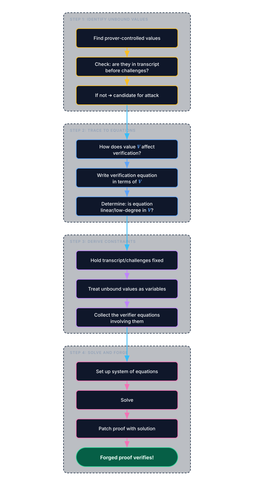

When a value $$V$$ isn't transcript-bound:
1. Challenges are fixed (independent of $$V$$)
2. The verification equation has form: $$f(V) = \text{target}$$
3. If $$f$$ is linear: $$\alpha \cdot V + \beta = \text{target}$$
4. Solve: $$V = (\text{target} - \beta) / \alpha$$

In the simplest linear case, forging reduces to solving a low-dimensional field equation, while other systems require small coupled systems.

For systems with multiple unbound values, we get a system of linear equations. Gaussian elimination solves it in $$O(n^3)$$ field operations. For non-linear constraints, we might need to use some more advanced techniques like resultants and Groebner bases.

---

## The Six Broken Systems

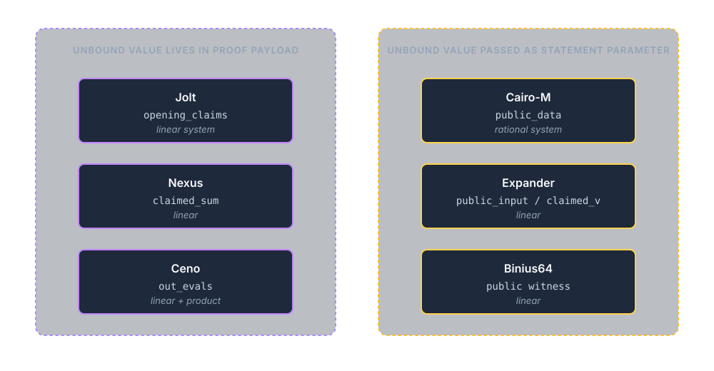


Now let's see how this plays out in each system. We'll go deep on the first one (Jolt) to establish the pattern, then focus on what's unique about each subsequent system.

<!-- 

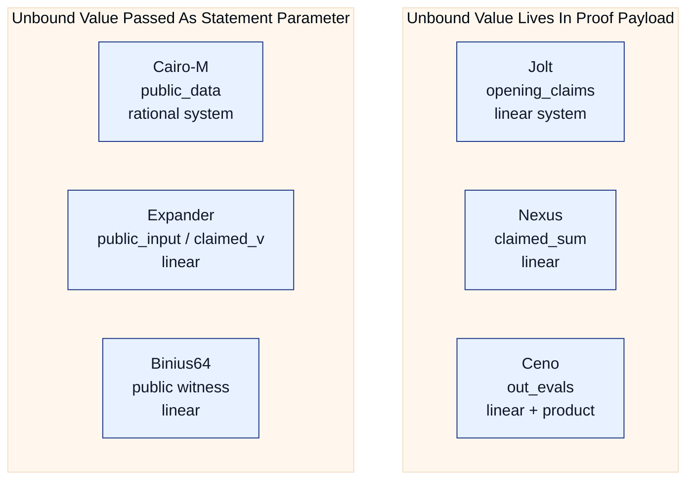

 -->

---

### Jolt (a16z)

Jolt is a zkVM for RISC-V programs, built by a16z. It uses sumcheck extensively to verify execution constraints.

**The proof structure:**

```
JoltProof {
    commitments: Vec<Commitment>,           // Polynomial commitments to trace
    opening_claims: Map<OpeningId, Claim>,  // <- THE VULNERABLE VALUES
    proofs: Map<Stage, SumcheckProof>,      // Sumcheck and opening proofs
    ...
}
```


**The verification flow:**

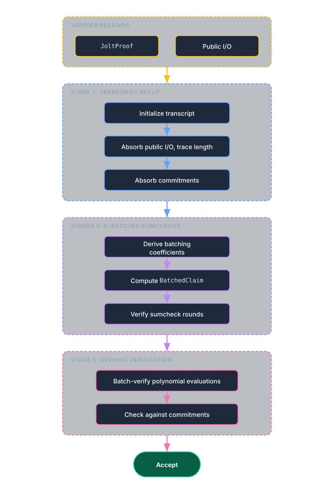

**The bug:** Each sumcheck instance provides an `input_claim`, which is the value the polynomial allegedly sums to over the Boolean hypercube. These claims come from `opening_claims` in the proof, but they were **never absorbed into the transcript** before the batching coefficients were derived.

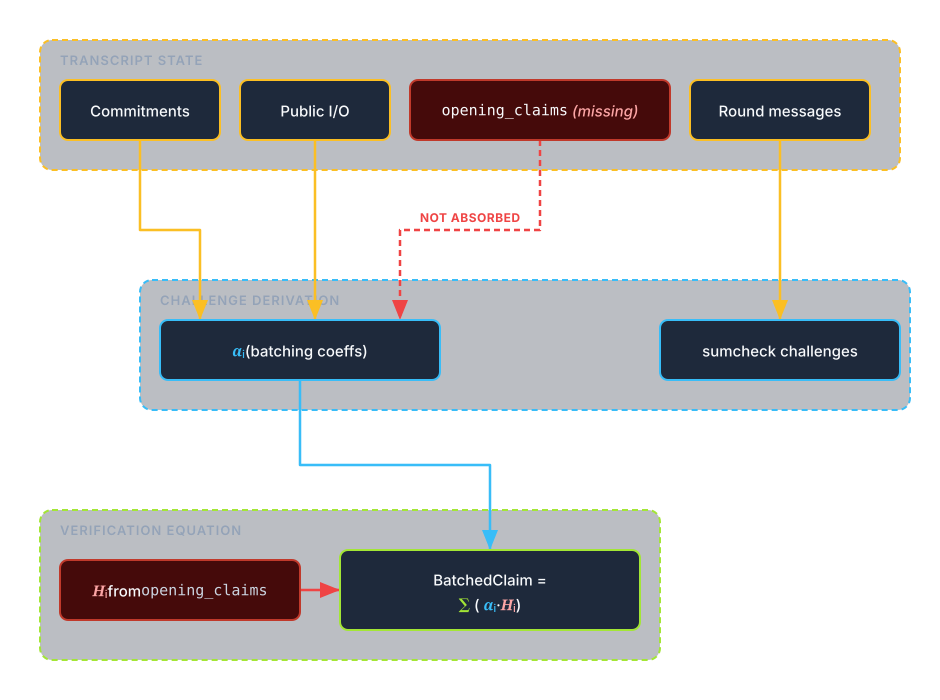

**How sumcheck uses opening_claims:**

In Jolt's batched sumcheck, the verifier computes a target value `BatchedClaim` by taking a random linear combination of the individual claims $$H_i$$:

$$\text{BatchedClaim} = \sum_i \alpha_i \cdot H_i$$

where $$\alpha_i$$ are random coefficients derived from the transcript. Since `opening_claims` (containing $$H_i$$) were not in the transcript, the $$\alpha_i$$ values are independent of $$H_i$$.

**Why it's linear:**

Due to the compression optimization (prover omits one less coefficient per round), the final verification equation traces back through the rounds and becomes linear in the input claim $$H$$

$$C_{\text{final}} = a \cdot H + b$$

where $$a, b$$ are determined by the transcript (independent of $$H$$). The verifier checks that $$C_{\text{final}} = \text{expected}\_\text{eval}$$ (from PCS opening), this becomes $$a \cdot H + b = \text{expected}\_\text{eval}$$.

Because multiple claims are coupled across verification stages, the attacker may need to adjust a small set of claim values simultaneously to satisfy all affected constraints.

This can be exploited by solving a small linear system over a handful of unbound claim values so all affected checks pass simultaneously.

**Status:** Fixed on October 3, 2025 via [PR #981](https://github.com/a16z/jolt/pull/981)

---

### Nexus

Nexus is a zkVM built on the Stwo prover (from StarkWare). It uses STARKs with logup lookup arguments.


Nexus splits verification into **components** such as instruction execution, memory, registers, etc. Each component handles a subset of constraints.

Each component emits and consumes lookup tuples. The component's `claimed_sum` summarizes its net contribution:

$$\text{claimed}\_\text{sum}_i = \sum_j \frac{1}{z - \text{produced}_j} - \sum_k \frac{1}{z - \text{consumed}_k}$$

All `claimed_sum` values must sum to zero (everything produced is consumed).

All constraints are combined into a composition polynomial. The verifier then checks this polynomial at a random point outside the execution domain, known as an **OODS (Out-of-Domain Sampling)** test.

**The proof structure:**

```
NexusProof {
    stark_proof: {
        commitments: [Merkle roots of trace columns]
        sampled_values: [polynomial evaluations]
        fri_proof: [low-degree test proof]
    }
    claimed_sum: [FieldElement; NUM_COMPONENTS]  // <- VULNERABLE
    log_size: [component sizes]
}
```

The`claimed_sum` values are checked to be of correct length, that they sum to zero, and are used in the final composition polynomial. But at no point were they absorbed into the transcript.

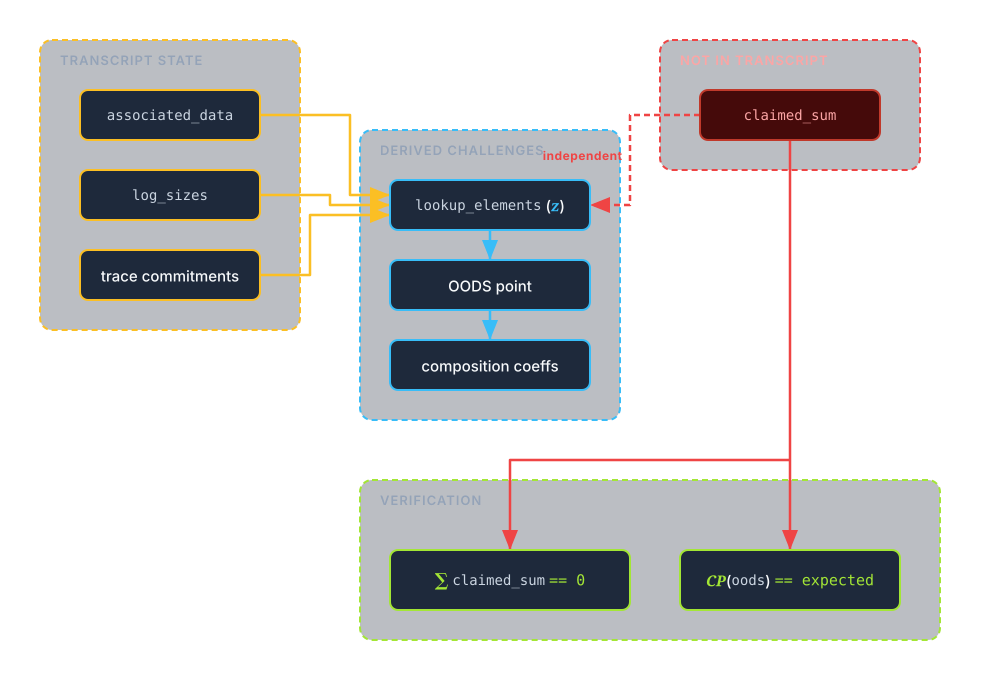

The OODS check computes the composition polynomial, which includes logup boundary constraints. These constraints are **linear in `claimed_sum`**:


The composition polynomial is a random linear combination of constraints:

$$C(x) = \sum_i \alpha_i \cdot \text{constraint}_i(x)$$

Since each constraint is linear in its `claimed_sum`, the overall composition polynomial is linear in all `claimed_sum` values.


The verifier checks $$C(\text{oods}\_\text{point}) = \text{expected}$$

With `claimed_sum` not in transcript, the composition polynomial becomes a linear function of the `claimed_sum` values. Combined with the constraint that claimed sums must sum to zero, this is a small linear system that is easily solvable.

**Status:** Fixed on October 24, 2025 via [PR #503](https://github.com/nexus-xyz/nexus-zkvm/pull/503)

---

### Cairo-M (Kakarot Labs)

Cairo-M, built by Kakarot Labs, is an alternative proof system for the Cairo VM (used by Starknet).

Cairo-M is in many ways similar to Nexus. It uses logup to prove global statements about the execution.

**The proof structure:**

```
Proof {
    claim: ComponentSizes,
    interaction_claim: LogupClaimsPerComponent,
    public_data: {          // <- VULNERABLE
        initial_registers: { pc, fp },
        final_registers: { pc, fp }, // <- forged
        clock,                       // <- forged
        initial_root,                
        final_root,                  // <- forged
        public_memory: { program, input, output }, //output modified
    },
    stark_proof: [...],
}
```

**The verification flow:**


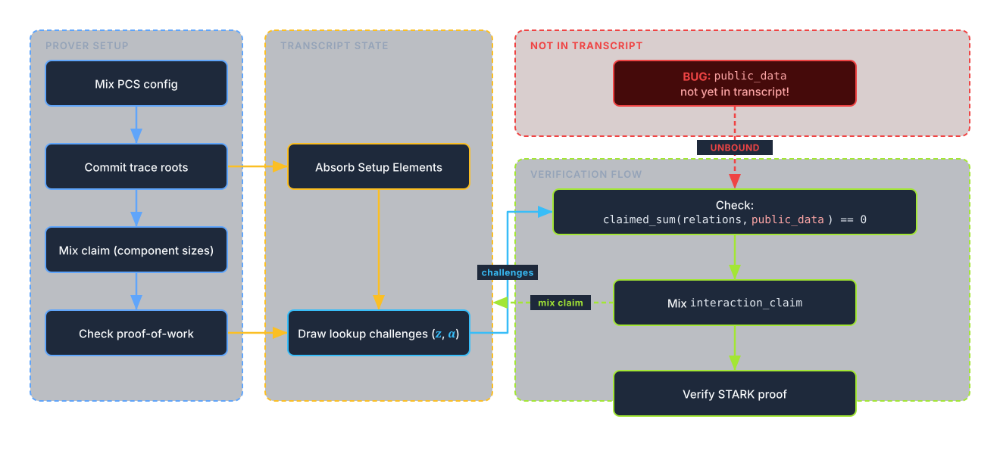

Lookup challenges are derived without `public_data` being  mixed into the transcript.

The `public_data` (program I/O, boundary registers, memory roots) enters the lookup relations inside *denominators* through challenge-weighted encodings of tuples. Abstractly, the verifier checks a relation of the form:

$$L(\text{public}\_\text{data}) + \text{(other transcript}\_\text{bound terms)} = 0, \qquad L = \sum_i \frac{1}{z + \langle \alpha, t_i(\text{public}\_\text{data})\rangle + \beta}.$$


The global check is then that $$L(p) + \text{(other terms)} = 0$$

With challenges fixed, this is a rational equation in public data. This is not linear, but still algebraically solvable.

Public-data coordinates participate in verification relations through extension-field arithmetic (including extension-valued public-memory entries), so the forged-parameter search is a coupled extension-field system.

**Status:** Fixed on October 31, 2025 via [commit 92b6740](https://github.com/kkrt-labs/cairo-m/pull/352/commits/92b6740937e904e0002e7ee099fec357127c1d16)

---

### Ceno (Scroll)

Ceno is a zkVM by Scroll, using GKR with a tower sumcheck structure.


Ceno splits verification into **chips**, with one per opcode or lookup table. Each chip proves its constraints independently.

Many per-record values (reads, writes, lookups) are batched into a binary tree structure. Each layer folds pairs of values with random challenges; this is the **tower sumcheck**.

All read records must match all write records (plus initial/final state). This is checked via a multiset equality, this time using a product instead of logup:

$$\prod_i \text{r}\_\text{out}\_\text{evals}_i = \prod_j \text{w}\_\text{out}\_\text{evals}_j \cdot (\text{state factors})$$

**The proof structure:**

```
ZKVMChipProof {
    r_out_evals: [[FieldElement]],   // <- VULNERABLE
    w_out_evals: [[FieldElement]],   // <- VULNERABLE
    lk_out_evals: [[FieldElement]],  // <- VULNERABLE
    tower_proof: [...],
    gkr_iop_proof: [...],
}
```

`r_out_evals`, `w_out_evals`, and `lk_out_evals` are used to initialize the tower sumcheck claim, but they're never absorbed into the transcript. This leaves us with two equations:

1. **GKR/Tower equation** (linear in `out_evals`):

   The tower sumcheck claim is $$\text{claim} = \sum_j \alpha^j \cdot \text{out}\_\text{evals}_j$$

   This check is linear in `out_evals`.

2. **rw-product consistency** (bilinear in `out_evals`):

$$\prod_i \text{r}\_\text{out}\_\text{evals}_i = \prod_j \text{w}\_\text{out}\_\text{evals}_j \cdot (\text{state factors})$$

   If we vary $$x_0 = {\text{r}\_\text{out}\_\text{evals}}[0][0]$$ and $$x_1 = {\text{r}\_\text{out}\_\text{evals}}[0][1]$$ we get the following constraint:

   $$x_0 \cdot x_1 \cdot (\text{rest of product}) = \text{target}$$

   This is bilinear in $$(x_0, x_1)$$.


We have two unknowns $$(x_0, x_1)$$ and two equations, one linear and one bilinear:

1. Linear (from GKR): $$a_0 x_0 + a_1 x_1 + c = 0$$
2. Bilinear (from multiset): $$k \cdot x_0 \cdot x_1 + d = 0$$

Substitution reduces this to a quadratic in one variable, which is solvable with the quadratic formula.

**Status:** Fixed on March 5, 2026 via [PR #1262](https://github.com/scroll-tech/ceno/pull/1262) (original report: [#1125](https://github.com/scroll-tech/ceno/issues/1125))

---

### Expander (Polyhedra)

Expander is a GKR-based proof system for arithmetic circuits.

**The proof structure:**

```
Proof (raw bytes, parsed in order):
    - PCS commitment
    - Sumcheck round polynomials (for each layer)
    - Layer claims (claim_x, claim_y)
    - PCS opening proofs

NOT in proof bytes (passed separately):
    - public_input    // statement data passed separately
    - claimed_v       // statement claim passed separately
```

In Expander's circuit model, constant gates can reference public input values. During GKR verification, the `eval_cst` evaluates the contribution of these gates at the sumcheck challenge point:

```rust
sum -= GKRVerifierHelper::eval_cst(&layer.const_, public_input, sp);
```

This evaluation is a linear combination of public input values, weighted by coefficients derived from the challenges stored in the verifier's scratch pad (`sp`).


**The vulnerability:**

`public_input` is never absorbed into the transcript. The transcript is initialized from the PCS commitment and sumcheck round messages, but public inputs are passed separately to the verifier.


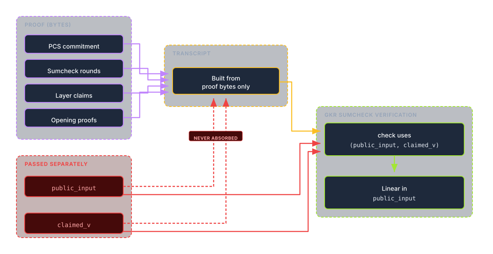

The `eval_cst` function computes a linear combination:

$$\text{eval}\_\text{cst} = \sum_i {\text{public}\_\text{input}}[i] \cdot \text{eq}(i, \vec{r})$$

where $$\vec{r}$$ contains the challenges. Since challenges are derived before the statement data is bound, they are independent of `public_input`. This lets an attacker choose an arbitrary false statement (e.g., a forged output) and then solve the induced linear constraints for a modified `public_input` that makes the verifier's check pass.


**Status:** Fixed on 21st January 2026 via [commit 4a8c2be](https://github.com/PolyhedraZK/Expander/commit/4a8c2be03535194c1f6b48a93ad2f5480649f7c2) <br>
 [Claimed 500k Bug bounty](https://blog.polyhedra.network/expander-bug-bounty/) award pending

---

### Binius64

Binius64 is a proof system optimized for binary fields, designed to be efficient on 64-bit CPUs. Binius uses $$\mathbb{F}_{2^{128}}$$ (or variants thereof), where addition is XOR. This makes certain operations very fast.

One of Binius's key features is its specialized protocols for bitwise operations. The **Shift Protocol** efficiently handles bit-shifts and rotations (essential for hash functions like SHA-256) without the massive overhead typical in other proof systems.

**The vulnerability:**

The verifier receives the public witness (program inputs/outputs) as a separate parameter:

```rust
pub fn verify<F, C>(
    constraint_system: &ConstraintSystem,
    public: &[Word],    // <- NEVER ABSORBED
    // ...
) -> Result<VerifyOutput<F>, Error>
```


In the shift protocol, challenges `r_j` and `inout_eval_point` are sampled **before** the public witness is bound.

**The verification flow:**

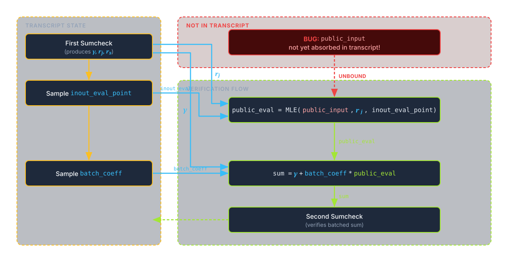

During verification
1. Sumcheck produces challenge points `r_j` (bit indices) and `r_s` (shift indices)
2. Verifier samples `inout_eval_point` from transcript
3. Verifier computes `public_eval = MLE(public, r_j, inout_eval_point)` using the unbound `public` slice 
4. The `public_eval` feeds into subsequent verification equations

The MLE evaluation is linear in the public witness bits:

$$\text{public}\_\text{eval} = \sum_{w,b} {\text{public}}[w][b] \cdot \text{eq}(b, r_j) \cdot \text{eq}(w, \text{inout}\_\text{eval}\_\text{point})$$

With challenges fixed (independent of `public`), an attacker can find an alternate witness $$\text{public}'$$ that produces the same evaluation. This is a single 128-bit linear constraint over hundreds of bits, yielding a single linear equation in a high-dimensional binary witness space, which is typically underconstrained and admits many alternative witnesses under common parameterizations.

<!-- The verifier computes `actual_eval` as a multilinear extension (MLE) of the `PublicInput` at the challenge points `r_j` and `inout_eval_point`.

Because the challenges are derived *before* the `PublicInput` is bound to the transcript, they are independent of it. The evaluation function:

$$f(\text{Input}) = \text{MLE}(\text{Input}, \vec{r}_{\text{fixed}})$$

is a linear function over the binary field. The attacker can exploit this linearity to find a collision. By solving a system of linear equations, an attacker can find a perturbation $$\delta$$ such that:

$$f(\text{OriginalInput} + \delta) = f(\text{OriginalInput})$$

This allows the attacker to forge a new public input `OriginalInput + delta` that satisfies the same sumcheck claim as the honest execution, effectively proving a false statement with a valid proof.
 -->

**Status:** Fixed on December 29, 2025 via [commit 86a515f](https://github.com/binius-zk/binius64/pull/1355/commits/86a515f0632d2acdf547ed82780dfe7f9f39358f)

---

## Why Does This Keep Happening?

Given that we found the same bug class in six independent implementations, at some point we have to ask whether there is a systemic issue making this mistake so common.

### Academic Papers Don't Specify Fiat-Shamir

Academic papers usually describe *interactive* protocols: "Prover sends $$C$$. Verifier sends<br>random $$r$$. Prover sends $$R$$."

They often omit the necessary steps to make the protocol non-interactive: "Hash $$C$$ before sampling $$r$$. Also hash the public statement. Also hash intermediate values that affect later equations."

Security proofs thus also analyze the interactive protocols where binding is implicit. The responsibility of determining what to include in the transcript therefore falls on the implementor, which may not have a good understanding of the full protocol.

### The Hot Potato Problem

Modern zkVMs are modular:

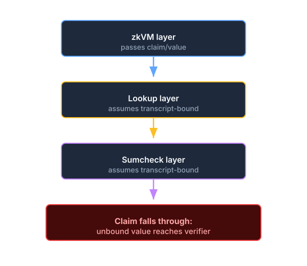

It often happens that each layer assumes the previous/next layer handles the transcript binding for a value, so in the end it never happens.

### Optimization Pressure

Performance is existential for ZK. Since every hash operation has a cost, there is constant pressure to exclude values that are "probably fine" to leave out.

There are indeed cases when this can be done safely, but determining what is safe requires a full understanding of all protocols involved, and the decision to exclude something should be double and triple checked by experts.

### Testing Doesn't Catch Adversarial Inputs

Unit tests run the honest prover. Integration tests run the honest prover. Fuzzing only randomly perturbs values and has a very low probability of succeeding in fooling a verifier. Identifying Fiat-Shamir bugs requires thorough manual security analysis, and sometimes even that falls short.

---

## How to Find and Fix These Bugs

### Prevention 

Fiat-Shamir has long been a known source of soundness bugs, which has driven the development of primitives that make implementation less error-prone.

One such tool is to merge the proof and transcript, to force all values that are sent by the prover to be automatically absorbed into the transcript.

The prover holds a proof buffer which emulates the communication channel between prover and verifier. When a value is sent by the prover it is added to the proof buffer and automatically absorbed into the transcript. When the prover then needs to read a challenge from the verifier it simply squeezes from the current transcript.

This can then be done in reverse for the verifier. It gradually reads values from the proof buffer and can thus sync the transcript state and derive the same challenges.

Halo2 follows this pattern, and Binius is transcript-centric as well. But even with a merged proof/transcript, statement data (e.g., public inputs) must still be absorbed before sampling any challenges that govern equations depending on them—and as Binius demonstrates, even transcript-centric systems can miss this.

---

## Responsible Disclosure Timeline

| System   | Reported | Fixed        | Response Time |
|--------  |----------|--------------|---------------|
| Jolt     | Sep 2025 | Oct 3, 2025  | <1 week       |
| Nexus    | Oct 2025 | Oct 24, 2025 | <1 week       |
| Cairo-M  | Oct 2025 | Oct 31, 2025 | <1 week       | 
| Ceno     | Nov 2025 | Mar 5, 2026  | ~4 months     |
| Binius64 | Dec 2025 | Dec 29, 2025 | <1 week       |
| Expander | Nov 2025 | Jan 21, 2026? | 3 months      |

All six teams were notified; responses ranged from immediate acknowledgement to delayed fix, and all reported issues have since been addressed.

---

## Challenges

Do you think you have a good understanding of these bugs? We have prepared challenges to allow you to practice implementing two of these exploits. If you solve any of them, follow the instructions in the flag ~~the first 10 solvers will get a T-shirt.~~

Your goal is to find a counter example of Fermat's Last Theorem, i.e you know $$a, b, c$$ such that $$a^3 + b^3 = c^3, a,b,c \ge 1$$. Good luck!

### Jolt
See <a href="handout_jolt.tar.gz" target="_blank" rel="noopener noreferrer" download="handout_jolt.tar.gz">the handout</a> for the setup running on the server.
Submit your proof by connecting to `jolt.chal.osec.io:8960`

### Nexus
See <a href="handout_nexus.tar.gz" target="_blank" rel="noopener noreferrer" download="handout_nexus.tar.gz">the handout</a> for the setup running on the server.
Submit your proof by connecting to `nexus.chal.osec.io:8950`

Now you should have enough margin to prove Fermat wrong. 

---

## Takeaways

We found critical soundness vulnerabilities in six separate zkVMs. All share the same root cause: prover-controlled values that affect verification equations were not bound to the Fiat-Shamir transcript before challenges were derived.

The fix in each case is trivial—one or two lines of code. But finding the bug requires understanding the full verification flow and asking: "What if the prover chose this value after seeing the challenges?"

**For the ZK ecosystem:** The Fiat-Shamir transform looks simple. Hash everything, derive challenges. In practice, "everything" is hard to specify when you have dozens of components, each with its own inputs and outputs, each expecting someone else to handle binding.

We found six instances by examining a handful of systems. How many more exist in the dozens of zkVMs, proof systems, and recursive verifiers deployed today?

**For auditors:** Draw the data flow. Trace the transcript. Check every prover-controlled value against when its relevant challenges are derived.

**For builders:** Treat the transcript as a sacred ledger. When in doubt, absorb it.


