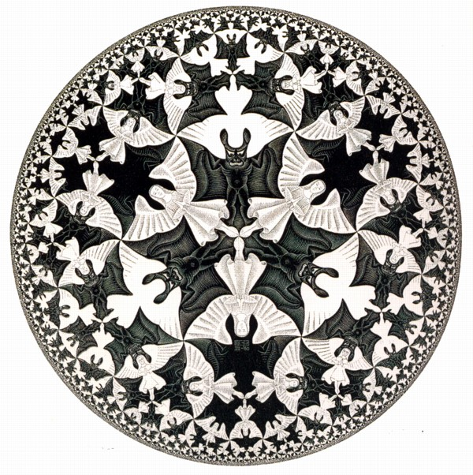

  

    
  

  

Hi, I am Himanshu Sheoran (alias deuterium), I am currently a senior undergradute at Indian Institute Of Technology, Bombay pursuing
Bachelor's Of Techonolgy in Computer Science and Engineering with a major crush on cybersecurity.

I have been playing a lot of [CTFs](https://deut-erium.github.io/ctf-tutorials/2021/04/04/What-Are-CTFs.html), nowadays with [zh3r0](https://ctftime.org/team/116018) 
where I can be found doing crypto tasks. My areas of interests include Cryptography, Reverse Engineering, Binary Exploitation, SMT/SAT solvers and programming in general.

In case you find some deuterium with a profile picture, with the same love for escher, [fractals](https://deut-erium.github.io/pyfractal/) and metal, its probably me.

This personal blog is aimed towards documenting my interests, research and interesting finds.

  

Hi, I am Himanshu Sheoran (alias deuterium), I am currently a senior undergradute at Indian Institute Of Technology, Bombay pursuing
Bachelor's Of Techonolgy in Computer Science and Engineering with a major crush on cybersecurity.

I have been playing a lot of [CTFs](https://deut-erium.github.io/ctf-tutorials/2021/04/04/What-Are-CTFs.html), nowadays with [zh3r0](https://ctftime.org/team/116018) 
where I can be found doing crypto tasks. My areas of interests include Cryptography, Reverse Engineering, Binary Exploitation, SMT/SAT solvers and programming in general.

In case you find some deuterium with a profile picture, with the same love for escher, [fractals](https://deut-erium.github.io/pyfractal/) and metal, its probably me.

This personal blog is aimed towards documenting my interests, research and interesting finds.

## CV
Enthusiastic employer with interest evoking challenging problems, [Hire Me]()

## Contact?
Always feel free to DM(direct message) on [discord](https://discord.com/new), Username: deuterium#1689.
Or any other convenient medium of choice linked below.

HACK THE PLANET :metal: :metal: :metal:

## PS: [DO NOT CLICK](https://www.youtube.com/watch?v=dQw4w9WgXcQ)

